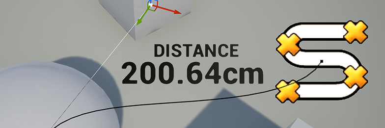

# ue4-measuring-tool
A simple distance measuring tool for Unreal Engine 4, created by Nick Mower.

The full tutorial can be found here: https://www.techarthub.com/how-to-make-a-distance-measurement-tool-in-unreal-engine-4/

This project is licensed under the Unreal Engine 4 EULA.
